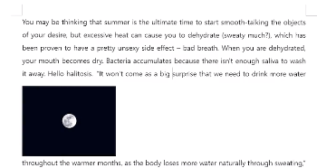
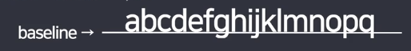
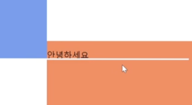
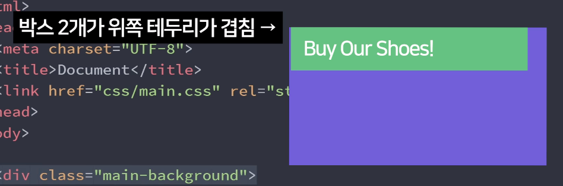

### 3강_기본적인 웹페이지 스타일링
- 이미지 가운데 정렬하는 방법
  - display: block;
  - margin-left: auto;
  - margin-right: auto;

- 글자 스타일링 방법
  - 자간 조절은 letter-spacing: 1px;
  - 글자 정렬은 text-align: center;
  - line-height의 값 : 감싸고 있는 부모태그의 높이값과 동일하게 해주시면 됩니다.
  - text-align의 값 : 가운데 배치를 뜻하는 center로 적용해줍니다.

- div 안에 div 중앙정렬
  - .outer {
      display: flex;
    }

    .inner {
      margin: auto;
    }
  
  ### 4강_css 파일 만들고 첨부하는 법
  - class selector (10점)
  - tag selector (1점)
  - id selector(100점)
    - id selector 가 가장 우선순위로 적용됨

  ### 5강_div를 이용한 네모네모 박스 디자인
  - div 중앙 정렬
    - display: block; 
      -  div 박스는 display: block 기본으로 가지고 있어서 생략 가능
      -  p, h 태그 또한 display: block을 기본적으로 가지고 있음
      -  글 쓰다가 중간에 이미지 삽입 시 글자들 사이에 이미지가 삽입 되는게 아니라 이미지가 가로행을 다 차지하는 것 처럼
    - margin-left: auto;
    - margin-right: auto;

  - 일부 스타일은 자동으로 부모-> 자식 inherit(상속) 됨
    - 예) font-size, color, font-family

  ### 6강_레이아웃 만들기1: 호환성 좋은 float
  - float: left 요소를 붕 띄워서 왼쪽정렬
  - claer: both , float 다음에 오는 요소에게 주면 float로 발생하는 이상한 현상 해결 가능
    - float 쓰고나서 다음에 오는 요소는 clear 주는게 좋음

### 7강_레이아웃 만들기2: 귀찮은 inline-block
  - display: block 
    - 한 행을 전부 차지
    - 
  
  - display: inline-block 
    - 내 크기만큼 차지, 내 폭과 높이만큼 자리차지하게 해주세요~
    - <태그> 사이에 스페이스바 공백이 있다면 그대로 보여주기 때문에 가로로 정렬하려면 태그 사이 공백도 제거 해줘야함
    - 
  
  - inline-block 사용시 공백제거 방법
    - 박스사이 주석기호 활용
      - 

 <!--dsd---> 

    - 부모태그에 font-size: 0px;
      - 부모 태그로 부터 inherit되는 스타일은 중요도가 가장 낮음, 부모에 font-size: 0px 을 주더라도 자식에서 다시 font-size 재설정 가능
  
  -  inline-block 박스 안에 글씨 쓰면 레이아웃이 깨지는 이유?
     - 
     - baseline이 옆에 존재하면 display: inline-block 요소들이 baseline 위에 오려고함
     - 
     - 주황색 박스안에 글씨 쓰니까 파란색 박스가 글씨 baseline에 맞춰서 정렬됨

### 9강_셀럭터를 이용해 CSS 코드 양 줄이기
  - float 관련 문제 
    - float준 요소 다음에 clear:both 넣은 div 추가하는걸 추천

  - selector 문법 중 공백
    - ~ 안에 라는 뜻 
      - .navbar(여기 한칸 띄우는 공백)li{
          display: inline-block;
         }
    - ~ 안에 있는 직계자식
      - .navbar>li{
          display: inline-block;
         }

### 10강_배경 이쁘게 넣는 스킬들 & margin collapse
  - 

      
안에 글씨

    

    - div 박스 안에 p 태그를 사용, p 태그에 상단 margin을 주기 위해 margin-top을 주게 되면 div와 p가 동시에 margin-top이 생기게 됨

 - 
  
  - 이 현상은 margin collapse effect 라고 부르는 일종의 버그로 원래 박스들의 테두리가 만나면 margin이 합쳐짐 (박스가 내부에서 만나든 외부에서 만나든 상관없음)
    - 1. 마진을 하나로 합쳐주고
    - 2. 혹여나 둘 다 마진이 있으면 둘 중에 더 큰 마진을 하나만 적용하게 됨

  - 해결방법
    - 강의 예제에선 부모 박스에 padding을 1px 이렇게 조금 주는 것으로 쉽게 해결 가능

### 11강_position과 좌표 레이아웃 만들기

  - position 부여하면 좌표 이동 가능
    - position: relative 내 원래 위치를 기준으로 이동하기

  - position 부여하면 공중에 뜸
  
  - position: fixed
    - 내 화면을 기준으로 위치 고정
    - 스크롤 해도 위치 고정된 네비게이션 만들때 쓰임

- position: absolute
  - 내 부모 태그가 기준
  - 부모 중에 position: reative가진 부모 기준
  - 